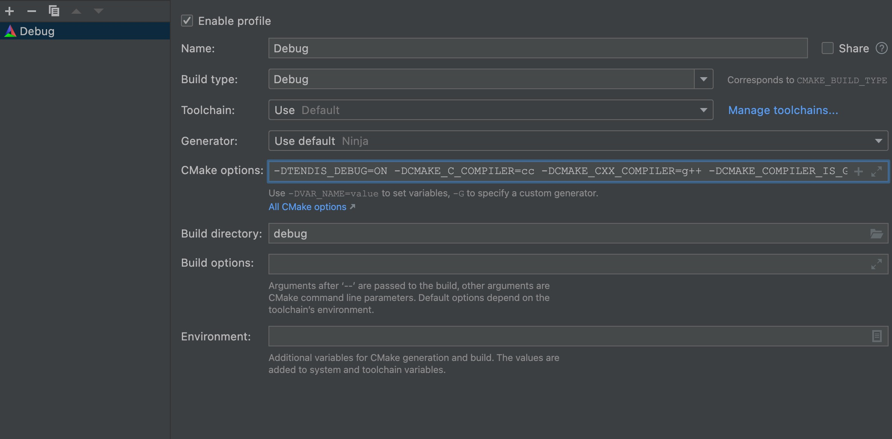

#### Mac平台构建，使用clion或者vscode阅读代码

tendis代码在Linux下能够很容易构建，但是在mac上通过cmake构建并不能够成功，即使本地已经安装了gcc,g++等工具，
可以在构建的时候添加相应的变量，可以使得tendis导入clion的时候能够完整的阅读代码。

##### 1. Requirements，这部分和github上的说明一致，可以通过brew安装

```
g++ (required by c++17, version >= 5.5)
cmake (version >= 3.13.0)
```

##### 2. Build，这部分需要修改，才能在mac下编译通过

###### 2.1 clone code
```
git clone https://github.com/Tencent/tendis.git --recursive
git submodule update --init --recursive

```

###### 2.2 build code(这两步骤是修改的，直接通过github上的步骤编译，是通不过的。)
```
mkdir debug
cd debug && cmake -DCMAKE_C_COMPILER=cc -DCMAKE_CXX_COMPILER=g++ -DCMAKE_COMPILER_IS_GNUCC=true ../

```

##### 2.3 导入代码到clion中

在将代码导入clion中的时候，需要调整cmake的配置，将上一步相应的配置加入




